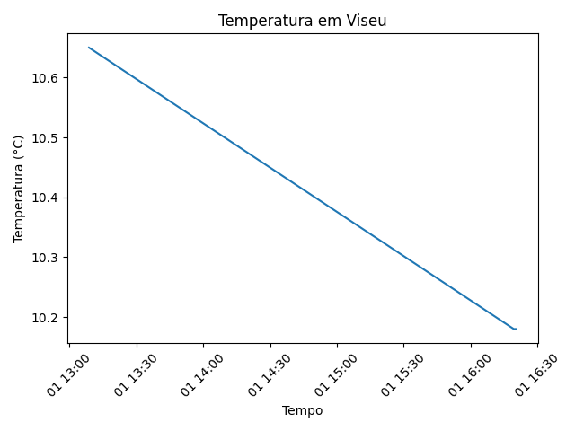

# 🌦️ API Data Collector 🌤️


Projeto em Python que recolhe dados meteorológicos da API OpenWeather e guarda localmente os resultados em ficheiros JSON e CSV, um ficheiro JSON por cidade, por execução.

---

## 📌 Funcionalidades

- Consulta do tempo por cidade
- Suporte a múltiplas cidades
- Tratamento de erros de rede
- Guarda resultados com timestamp
- Cria automaticamente pasta `data/`
- Geração automática de gráficos de temperatura

---
## 📊 Exemplo de gráfico gerado

O projeto gera automaticamente gráficos de temperatura com base nos dados recolhidos.

Exemplo para a cidade de Viseu:



---

## 🛠️ Requisitos

- Python 3.10+
- Conta gratuita em https://openweathermap.org
- requests
- pandas
- matplotlib
---

## 🚀 Instalação

### 1. Clonar repositório

```
git clone https://github.com/martin3s-hub/api-data-collector.git
cd api-data-collector
```

### 2. Criar ambiente virtual

```bash
python -m venv .venv
```

Ativar (Windows):
```bash
.venv\Scripts\activate
```

### 3. Instalar dependências
```bash
pip install -r requirements.txt
```
### 4. Configurar API Key

Cria um ficheiro `config.py` na raiz do projeto:
```python
API_KEY = "A_TUA_API_KEY_AQUI"
```
(Obtém a key em https://openweathermap.org
)

⚠️ Não faças commit do ficheiro `config.py` (já está incluído no `.gitignore`).

### 5. Executar o programa
```bash
python main.py
```
Introduz as cidades separadas por vírgulas:
```text
# exemplo de input
Lisboa, Porto, Madrid
```

Os ficheiros serão guardados automaticamente na pasta data/

Exemplo de output:

```json
{
    "cidade": "Lisboa",
    "temperatura": 18.4,
    "humidade": 72,
    "descricao": "céu limpo",
    "timestamp": "2026-01-31T10:32:12"
}
```

## 📈 Funcionalidades planeadas para evoluir o projeto:

- ~~Exportar dados para CSV~~ ✅
- Melhorar estrutura do projeto  
- Criar segundo projeto usando outra API  

---
## ⚙️ Como funciona

O programa pode ser usado de duas formas:

---

### ▶️ Modo interativo (manual)

Executa:

```bash
python main.py
```

Depois escreve as cidades:

```text
Lisboa, Porto, Madrid
```

---

### ▶️ Modo automático (CLI)

Podes passar as cidades diretamente pela linha de comando:

```bash
python main.py Lisboa Porto Madrid
```

---

### ▶️ Guardar apenas em CSV

Usa a flag `--csv-only`:

```bash
python main.py Lisboa Porto --csv-only
```

Neste modo:

- Não são criados ficheiros JSON  
- Apenas o ficheiro `data/dados.csv` é atualizado  

---

## 🚨 Tratamento de erros

O programa distingue:

- Cidade não encontrada  
- Erros da API (401, 500, etc)  
- Erros de rede  

Exemplos:

```text
Cidade não encontrada
Erro da API (401): Unauthorized
Erro de rede para Lisboa
```
---
## 🧪 Exemplo completo de execução

### 1️⃣ Recolher dados meteorológicos

Executa:

```bash
python main.py Viseu Porto Lisboa
```
Ou em modo interativo:
```bash
python main.py
```
Depois escreve:
```text
Viseu, Porto, Lisboa
```

Isto irá:

- Consultar a API OpenWeather
- Criar ficheiros JSON por cidade
- Atualizar o ficheiro data/dados.csv


### 2️⃣ Atualizar apenas CSV
```bash
python main.py Viseu Porto --csv-only
```
Neste modo:

- Não são criados ficheiros JSON
- Apenas o CSV é atualizado

### 3️⃣ Gerar gráfico de temperatura

Depois de existirem dados no CSV:
```bash
python grafico.py Viseu
```
O gráfico será guardado automaticamente em:
```bash
charts/grafico_viseu.png
```
Fluxo típico do projeto:
```bash
python main.py Viseu Porto
python grafico.py Viseu
```
---
## 📁 Estrutura do projeto

```text
api-data-collector/
│
├── main.py
├── grafico.py
├── config.py
├── requirements.txt
├── README.md
│
├── data/
│   └── dados.csv
│
└── charts/
    └── grafico_viseu.png


```

---

## 🗺 Roadmap

- [x] Guardar dados em JSON  
- [x] Criar pasta automaticamente  
- [x] Timestamp nos ficheiros  
- [x] Exportar para CSV  
- [x] Argumentos por linha de comando 
- [ ] Histórico diário  
- [x] Gráficos simples  

---

## 🧠 Objetivo do projeto

Projeto criado para praticar:

- Python
- APIs REST
- JSON / CSV
- Automação simples
- Organização de projetos
- requests


---
## 🧑‍💻 Autor

Pedro Martins  
Projeto criado para aprendizagem de Python, APIs e automação de dados.

